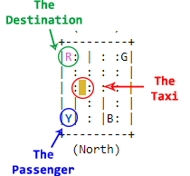

## Coding Challenge -- Due Date, Thursday November 23rd, 2017

This week's coding challenge is to implement Value iteration algorithm built for the <a href="https://gym.openai.com/envs/Taxi-v1/">Taxi-v1</a> environment by OpenAI Gym library. By <a href="https://github.com/llSourcell/AI_for_Video_Games_Syllabus">Siraj Raval.</a>

The submission file is: <a href="">RL_Value_Iteration_Taxi.ipynb</a>

## Dependencies for challenge

* numpy
* (OpenAI Gym)[https://gym.openai.com/docs/]

## Environment

That's the least relevant thing but, as mentioned before, <a href="https://gym.openai.com/envs/Taxi-v1/">"Taxi"</a> environment has been chosen.

It's a simple game. At least for humans :) 

You have a Taxi. In a little "city". You also have the direction of a passenger and a destination. Of course, you have to go to the position of your passenger, pick them and go to the destination **in the shortest path**

Hope that with the image it's all clear :D

### References

(Siraj Raval - Youtube - Introduction to AI for Video Games)[https://www.youtube.com/watch?v=i_McNBDP9Qs]

(Taxi - OpenAI Gym)[https://gym.openai.com/envs/Taxi-v1/]

(An overview of MAXQ hierarchical reinforcement learning)[https://link.springer.com/book/10.1007/3-540-44914-0#page=38]

(Deep Reinforcement Learning Demysitifed (Episode 2) — Policy Iteration, Value Iteration and Q-learning)[https://medium.com/@m.alzantot/deep-reinforcement-learning-demysitifed-episode-2-policy-iteration-value-iteration-and-q-978f9e89ddaa]