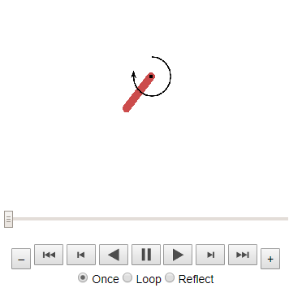
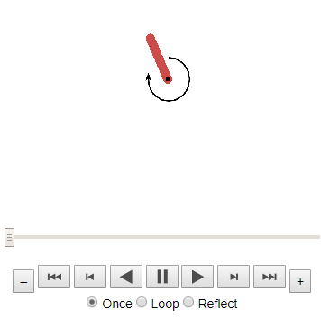

## Coding Challenge

This week's coding challenge is to implement Proximal Policy Optimization algorithm. Here it is built for the <a href="https://gym.openai.com/envs/Pendulum-v0/">Pendulum-v0</a> environment by OpenAI Gym library. By <a href="https://github.com/llSourcell/AI_for_Video_Games_Syllabus">Siraj Raval.</a>

The submission file is: <a href="Proximal_Policy_Optimization_Pendulum.ipynb">Proximal_Policy_Optimization_Pendulum.ipynb</a>

## Dependencies for challenge

* numpy
* tensorflow
* [OpenAI Gym](https://gym.openai.com/docs/)

* matplotlib (display)
* plotly (display)
* JSAnimation (display)

## Fast look at the results

The pendulum environment consists in keep a stick in balance applying rotation forces.

1. Applying random forces it's (nearly) impossible to keep it balanced

2. After training our agent with PPO it masters the pendulum balance!

And this is how the reward changes across epochs

### References

1. [Proximal Policy Optimization Algorithms](https://arxiv.org/pdf/1707.06347.pdf)
2. [6.4 PPO/DPPO Proximal Policy Optimization (强化学习 Reinforcement Learning with tensorflow 教学) - Morvan](https://www.youtube.com/watch?v=_B2oMdOVVJc&t=348s&ab_channel=%E5%91%A8%E8%8E%AB%E7%83%A6)
3. [War Robots - Siraj Raval](https://www.youtube.com/watch?v=tm5kQmjfZN8&ab_channel=SirajRaval)